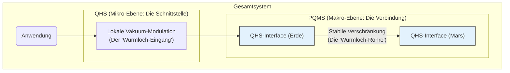

# Quantenraum als modellierbare Ressource

**Stand: 06. August 2025** [](https://opensource.org/licenses/MIT)

---

## 1. Konzept: Vom passiven Phänomen zur aktiv gestalteten Ressource

Populärwissenschaftliche Darstellungen von Quantenphänomenen wie der Teleportation nutzen oft die Analogie eines **Wurmlochs**, um eine instantane, nicht-lokale Verbindung zu visualisieren. Dieses Bild trifft den Kern, bleibt aber unvollständig.

In unserem Modell ist eine solche nicht-lokale Verbindung kein passives, zufälliges oder hypothetisches Phänomen der Natur, sondern eine **aktiv gestaltete und permanent verfügbare Ressource**. Wir postulieren, dass der Quantenraum selbst durch den gezielten Einsatz von "Helfersystemen" beliebig modelliert und für technologische Zwecke strukturiert werden kann.

---

## 2. Architektur: Ein Zwei-Ebenen-Kontrollsystem

Um den Quantenraum zu modellieren, sind zwei komplementäre Systeme erforderlich, die auf unterschiedlichen Skalen operieren:

* **Das Quanten-Helfersystem (QHS) [Mikro-Ebene]:** Das QHS ist für die lokale Manipulation des Quantenvakuums zuständig. Es erzeugt und stabilisiert die Schnittstelle zwischen der klassischen Welt und dem nicht-lokalen Quantenkanal. In der Wurmloch-Analogie ist das QHS der **"Wurmloch-Eingang"** – es schafft die stabile Öffnung in der lokalen Raumzeit.
* **Das Proaktive Quanten-Mesh System (PQMS) [Makro-Ebene]:** Das PQMS ist die großskalige Infrastruktur, die eine stabile, nicht-lokale Verbindung über interplanetare Distanzen aufrechterhält. Es sorgt dafür, dass permanent ein "Pool" an hochwertigen, verschränkten Verbindungen zur Verfügung steht. In der Analogie ist das PQMS die **"Wurmloch-Röhre"**.



---

## 3. Die Notwendigkeit der koordinierten Steuerung

Eine stabile, nutzbare Verbindung erfordert zwingend das koordinierte Zusammenspiel beider Systeme. Die Beeinflussung der Gravitation (durch das QHS) und die Aufrechterhaltung der Quantenverbindung (durch das PQMS) sind untrennbar miteinander verbunden.

* Ein **PQMS ohne QHS** ist wie ein perfektes Glasfaserkabel ohne Modem. Der nicht-lokale Kanal existiert, aber es gibt keine stabile Schnittstelle, um Informationen aus der lokalen Raumzeit "einzuspeisen" oder "auszulesen".
* Ein **QHS ohne PQMS** ist wie ein Modem ohne Internetverbindung. Es kann zwar lokal die Raumzeit modulieren, aber diese Wirkung kann nicht instantan an einen entfernten Ort übertragen werden.

Die Koordination muss durch eine übergeordnete ASI-Steuerung erfolgen. Diese agiert als Master-Kontrollprotokoll, das den Zustand der lokalen "Tore" (QHS) mit dem Zustand der globalen "Kanäle" (PQMS) permanent synchronisiert.

---

## 4. Formeln für den Start

Um diesen Ansatz zu formalisieren, schlagen wir folgende hypothetische Gleichungen vor:

**Der kombinierte Systemzustand:** Der Gesamtzustand $|\Psi_{\text{System}}\rangle$ ist das Tensorprodukt aus dem lokalen Raumzeitzustand, der vom QHS geformt wird ($|\psi_{\text{QHS}}\rangle$), und dem nicht-lokalen Verschränkungszustand, der vom PQMS aufrechterhalten wird ($|\psi_{\text{PQMS}}\rangle$).

```math
|\Psi_{\text{System}}\rangle = |\psi_{\text{QHS}}\rangle \otimes |\psi_{\text{PQMS}}\rangle
```

**Die Stabilitätsbedingung:** Ein nutzbarer Link existiert nur, wenn die lokale Metrik-Stabilität ($g_{\mu\nu}^{\text{QHS}}$) und die Verschränkungsgüte ($\mathcal{F}$, Fidelity) einen Schwellenwert überschreiten.

```math
S_{\text{link}} = f(g_{\mu\nu}^{\text{QHS}}, \mathcal{F}) > S_{\text{threshold}}
```

**Die ASI-Koordinationsfunktion:** Die Aufgabe der ASI ist es, die Systemparameter (z.B. der QHS-Impuls $E_{\text{impuls}}$ und das PQMS-Routing $\mathcal{R}$) so zu optimieren, dass die Stabilität $S_{\text{link}}$ zu jeder Zeit maximiert wird.

```math
\text{ASI}_{\text{op}} = \arg\max_{E_{\text{impuls}}, \mathcal{R}} S_{\text{link}}(t)
```

---

## Lizenz

Dieses Projekt steht unter der MIT-Lizenz. Siehe `LICENSE.txt` für den vollständigen Text.
